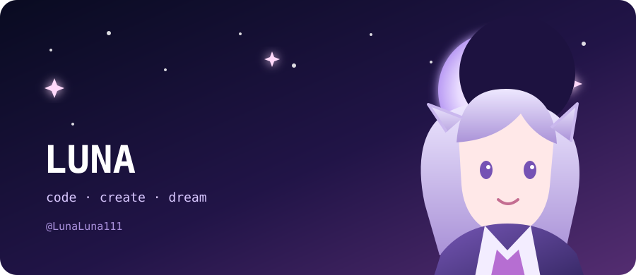

`夢を見る人は、未来をつくる。`

### 🌙 关于我 · About Me

正在探索代码与创意的交界处。  
喜欢漂亮、简单且真正有用的东西。  
这里会记录我的项目、实验，以及一路收集的星光。

### ✦ 当前频道

| 状态 | 坐标 | 今日目标 |
|:---:|:---:|:---:|
| 🌱 持续学习 | GitHub 星海 | 写一点有趣的东西 |

> `System.out.println("Hello, new world!");`

### 🐾 留下一点足迹

「愿每一次提交，都离想要的世界更近一点。」

<!--
  Profile layout inspired by the MIT-licensed GitHub Profile Styler:
  https://github.com/allifiz/github-profile-styler
-->
